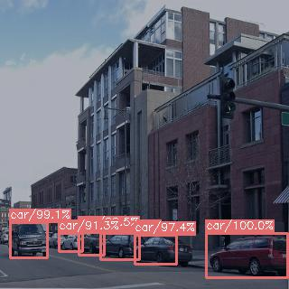
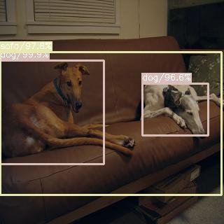
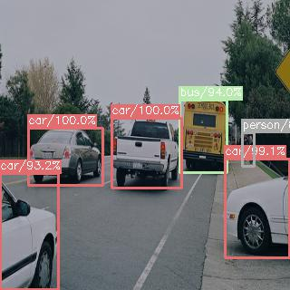
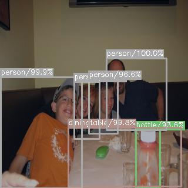

# RON Detector in TensorFlow: Reverse Connection with Objectness Prior Networks for Object Detection 

RON is an efficient object detection system as descibed in [This CVPR paper](http://openaccess.thecvf.com/content_cvpr_2017/papers/Kong_RON_Reverse_Connection_CVPR_2017_paper.pdf). 

This repository contains code of the re-implement of RON following the above paper. Now almost all of the implementation details matches the [open-source version](https://github.com/taokong/RON) by the the author of RON.

The code is modified from [SSD-Tensorflow](https://github.com/balancap/SSD-Tensorflow). You can use the code to train/evaluate your network for object detection task. 

For more details (including dataset prepare), please refer to [README of SSD-Tensorflow](https://github.com/balancap/SSD-Tensorflow/blob/master/README.md).

##  ##
update:

- Add SSD preprocesing method using Tensorflow ops [zero ground truth fixed]
- Modify details of the network to match the original Caffe code
- Add NMS using Tensorflow ops to support two mode
- Fix most part of the matching strategy between ground truth and anchors
- Replica GPU training support (If you are using Tensorflow 1.5.0+, then rename the replicate_model\_fn.py)
- Add voc eval with debug
- Add realtime eval, using class-wise bboxes-select and nms
- Add support for training use *vgg16_reducedfc* model converted from pytorch, you can get from [here](https://drive.google.com/open?id=184srhbt8_uvLKeWW_Yo8Mc5wTyc0lJT7)
- Other important fixes **[2018.03.21]**
- Make all anchors on different layers be matched together, to avoid some suboptimal matching results
- Refactor anchors matching pipeline
- Fix attribute 'difficult' missing problem in the TFRecords dataset
- Model-320 (reduced version) trained on VOC07+12 dataset now is available at [here](https://drive.google.com/open?id=1rWONPxt9sBby2RxK2JMZgdRamrhRic3v), the heavier one needs to be trained by yourself(may I will also update a trained model later)

Note: Model trained (07+12 VOC-train and test on VOC07-test) using the initial version of this code can only get to 0.45~0.55mAP, clone the latest version will give you much better performance at 0.7+mAP(needs ~120k steps). Futher improvement is still going on.

Here are some demo result images of reduced-version RON detector trained using this code:

